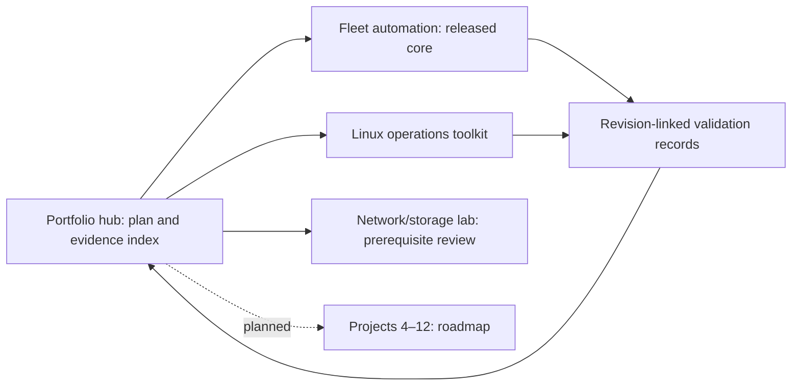

# Linux and DevOps engineering portfolio

This is a developing portfolio of executable Linux operations and DevOps labs.
It connects source, tests, operational procedures, and revision-linked evidence
so a reviewer can distinguish implemented behavior from planned extensions.
The work is lab/reference engineering, not a claim of production readiness,
employment experience, or coverage of every tool.

The first implemented project is the public
[Linux operations toolkit](https://github.com/Yash-PK/ops-linux-operations-toolkit),
a read-only Bash/Python health and inspection CLI. Its 58 tests, local gates and
clean-clone validation passed; its
[Linux CI run](https://github.com/Yash-PK/ops-linux-operations-toolkit/actions/runs/37459272607)
passed at `0b0f077933bb06e2b9016f50ff5d8b1fbcebddf4`. That run exercised real
Ubuntu health sources, metadata inspection, certificate expiry and backup
freshness. The toolkit core is complete and
[release v0.1.0](https://github.com/Yash-PK/ops-linux-operations-toolkit/releases/tag/v0.1.0)
is published at `0d164e9158eeb9540e895d5f48bcf4723f36667b`. The
[release-revision CI run](https://github.com/Yash-PK/ops-linux-operations-toolkit/actions/runs/37573353795)
passed for that exact target; it does not replace the earlier evidence revisions.

This hub is a published work-in-progress index. Its local, clean-clone and
[hosted CI gates](https://github.com/Yash-PK/ops-linux-devops-portfolio/actions/runs/37573748935) passed.
Two of twelve engineering cores are complete, with three public repositories
including this hub. The [fleet automation project](https://github.com/Yash-PK/ops-linux-fleet-automation)
passed 74 controller tests, clean-clone checks, and both Ubuntu 24.04 and AlmaLinux
9.8 ARM64 real-VM profiles. Each demonstrated strict SSH rejection, Molecule
convergence/idempotence, policy/service checks, content rollback, patch/reboot
verification before repair and scoped teardown. Its
[v0.1.0 release](https://github.com/Yash-PK/ops-linux-fleet-automation/releases/tag/v0.1.0)
is verified at `1531b86b54eee87d01da83f7b55d7d405f43fadb`, with
[passing exact-revision CI](https://github.com/Yash-PK/ops-linux-fleet-automation/actions/runs/37615270935).

Ten engineering projects remain. The network/storage lab is now the only active
project, at prerequisite/acceptance review; its capabilities remain planned.
Projects 4–12 remain roadmap entries. See [project status](PROJECT_STATUS.md) and
the [evidence index](docs/evidence-index.md) for revision and environment boundaries.

## Start here

- [Portfolio plan and bounded acceptance](PORTFOLIO_PLAN.md)
- [Skill-to-code and evidence matrix](SKILLS_MATRIX.md)
- [Current status and publication gates](PROJECT_STATUS.md)
- [Exact next work](NEXT_STEPS.md)
- [Evidence index](docs/evidence-index.md)
- [Dependency map](docs/dependency-map.md) and [extension backlog](docs/extension-backlog.md)

## Architecture



The hub and project repositories are siblings. No project is nested inside this
repository or implicitly imported from a sibling directory. Future integrations
must consume an explicitly pinned release and retain a standalone quickstart.
The [architecture](docs/architecture.md) and
[local-first decision](docs/decisions/0001-local-first.md) explain the boundary.

## Local quickstart

Prerequisites for hub checks are Git, GNU Make or compatible Make, Bash, and
Python 3.11 or later; Python 3.14.7 is the exercised interpreter. See the
[dependency record](docs/dependencies.md) for pinned developer tools. This hub itself
does not require Docker, a Linux VM, cloud credentials, or privileged execution.
From a local checkout of this repository:

```sh
make help
make bootstrap
make doctor
make validate
make demo
make security
```

If `python3` is older than 3.11, bootstrap with
`make PYTHON=/path/to/python3.14 bootstrap`; later targets use `.venv/bin/python`.

`make help` lists the supported targets. Validation checks the hub's documentation,
metadata, and repository hygiene. The demo is a local portfolio inspection;
engineering demonstrations belong to the relevant project. Follow that
project's own README from its own checkout; the hub does not silently clone,
install, deploy, or execute sibling projects.

Expected behavior is an honest status report with zero cloud resources created.
If a required dependency or check is missing, resolve it locally within the stated
authorization boundary and rerun the failing command. Do not relabel an unavailable
check as passed. A passing hub check does not prove any planned project works.

## Demonstration and review

Read the toolkit acceptance checklist, run its documented fixture and read-only
demo commands, and compare the resulting statuses with its validation report.
The degraded fixture should exercise a meaningful nonzero health exit code;
recovery means rerunning against the healthy fixture, without host changes.
Linux-specific integration is separate from a portable development-host demo.

For a standalone toolkit checkout, use the verified public repository:

```sh
git clone https://github.com/Yash-PK/ops-linux-operations-toolkit.git
cd ops-linux-operations-toolkit
make bootstrap
make validate
make demo
```

The demo asserts synthetic healthy/degraded/unavailable/invalid outcomes and
performs portable read-only checks. `make integration` additionally requires
Linux and its documented tools. The recorded Ubuntu CI integration observed
`dbus.service`, journald, schedules and ACLs; it does not establish full OS
boot/reboot, privileged diagnostics, cgroup policy, or cloud deployment.

For an interview walkthrough, explain why unavailable data remains unknown, why
health and execution failures have different exit codes, and how fixture tests
differ from a live Linux run. Point to the implementation and recorded command
results for each assertion. The decision record also explains why the portfolio
starts with an operations CLI before adding stateful deployment infrastructure.

## Security, resources, and limits

New public `ops-` repositories under the explicitly confirmed personal account
`Yash-PK` are authorized only after publishing gates pass. No cloud apply, billable
services, container registry publication, or host configuration changes are
authorized. CI defaults to read-only permissions. The
[security policy](SECURITY.md) describes how to handle sensitive findings.

Hub checks are small local text/file operations. Required CPU, memory, disk,
architecture, virtualization, and privilege assumptions for later labs belong in
their own verified prerequisites. Containers will not be represented as VMs;
emulators will not be represented as proof of cloud compatibility.

`make clean` removes only the repository's ignored `.runtime` directory.
Toolkit temporary validation clones and integration files have been cleaned;
local `.venv` and `.tools` caches are retained. The hub clean-clone gate also
passed and removed its scratch checkout. Both fleet guests and clean-clone scratch
checkouts were removed; its owned registry is empty. Approximately 1.05 GiB of
image caches remains, alongside local tools and ignored private metadata/credentials.
The fleet cleanup policy governs those resources. No cloud resources or host
configuration changes are authorized.
Do not delete project repositories or private ownership records as a cleanup
shortcut.

The [matrix](SKILLS_MATRIX.md) intentionally leaves unimplemented capabilities
planned. Later projects add the asynchronous jobs reference workload, automation,
platform delivery, telemetry, security, recovery, and a bounded incident
simulation, in dependency order. Larger enterprise alternatives stay in the
extension backlog until they can be implemented and tested meaningfully.

The [publishing guide](docs/publishing.md) describes collision checks, exact
commands and the required clean-clone gate.

Original work is licensed under [MIT](LICENSE). See
[contributing](CONTRIBUTING.md), [continuation guidance](AGENTS.md), and the
[changelog](CHANGELOG.md).
