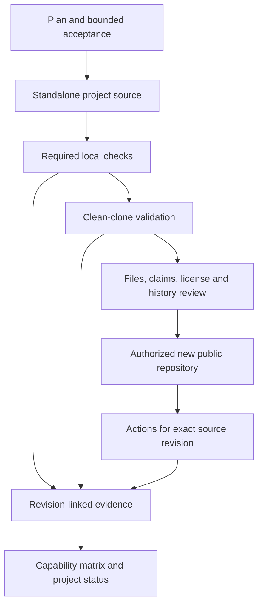

# Portfolio architecture

The hub is a small text/configuration repository that makes operational evidence
discoverable. It does not contain the other projects' source trees or automatically
run their workloads. Separate sibling repositories preserve useful boundaries:
independent quickstarts, release lifecycles, tests, licenses, and reviewable changes.

Publication is a separate transition from capability validation. A local project
can be tested while upload is blocked; a published hub can remain a work in
progress. CI status belongs to a specific source revision and must not be inferred
from a workflow file. A missing required check blocks tested/released designation.

The implementation boundary starts with a read-only operations CLI. Bash
orchestrates demonstrations; Python owns structured collection, parsing, policy,
and output. Future automation provisions disposable VMs rather than modifying the
development host. The later stateful application supplies a common asynchronous
job workflow across delivery, Kubernetes, observability, security, and recovery.

Evidence progresses from fixture/static checks to real local integrations and,
only if separately authorized, cloud deployments. Linux kernel evidence requires
Linux execution. A Linux container may prove selected `/proc` collectors but not
VM reboot, real systemd, kernel isolation, storage administration, or a cloud
provider. The exact environment and limits travel with each result.

Cross-project composition uses explicit pinned releases and documented contracts.
The [dependency map](dependency-map.md) identifies those contracts. Every consumer
still needs a reproducible standalone quickstart; sibling directories are not
dependency management.

No private runtime inventory, credentials, raw sensitive logs, backup archives,
or IaC state belong in source or public evidence. Synthetic fixtures are deliberate
test input and must be labeled as such. Local outputs are reviewed/redacted before
being committed. History scanning complements `.gitignore`; neither replaces
manual review.
