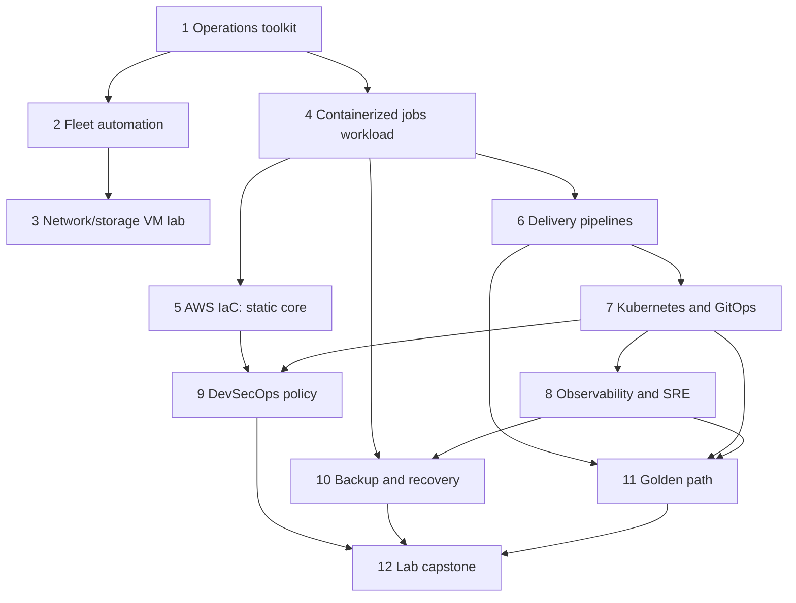

# Dependency map

Repository order follows operational dependencies and keeps one engineering
project active. Hub upkeep supports the active project and does not create another
implementation workstream. This diagram describes the plan; only the first
milestone is active.

The numerical sequence remains the default execution order even where a graph
edge allows independence. Future project activation requires a bounded core
acceptance checklist and a supported execution environment first.

| Consumer | Required producer / contract | Reproduction rule |
| --- | --- | --- |
| Fleet and network/storage labs | Operations toolkit checks, when used | Pin a tested toolkit release; never depend on an untracked sibling checkout. |
| Delivery | Reference app source, tests, build definition | Pin app revision/release; core checks reproduce locally. |
| Kubernetes | Reference app artifact/configuration and delivery contract | Pin immutable artifact digest once authorized to publish; otherwise document locally built image and source revision accurately. |
| Observability | Reference app instrumentation and deployed workload | Pin compatible instrumentation and platform releases, with minimal and extended profiles. |
| Security | Delivery/IaC/Kubernetes artifacts as applicable | Test each policy against a specific input contract and safe fixtures. |
| Recovery | Reference PostgreSQL schema and identifiable synthetic data | Pin schema/seed versions; restore into a distinct destination. |
| Golden path | Validated workload/platform/telemetry contracts | Generated services use explicit versioned dependencies, not original-account assumptions. |
| Capstone | Completed, tested producer releases | A manifest pins each producer; scripts fetch or verify releases without copying codebases. |

The reference workload will be an asynchronous synthetic jobs service with API,
worker, PostgreSQL, queue/cache, and reverse proxy. Delivery, Kubernetes,
observability, security, and recovery will exercise this common application.
The application is planned, not implemented by this hub.

No remote source, dependency version, image digest, or cross-project release has
been invented here. Each active project records official support/release/advisory
research before selecting dependencies. A project must have a standalone
quickstart with exact compatible versions and lockfiles where applicable.

Cloud credentials, an authenticated plan, cloud deployment, package publication,
and public service exposure are not implicit prerequisites for local cores. Any
future profile requiring them stays gated until explicitly authorized.
