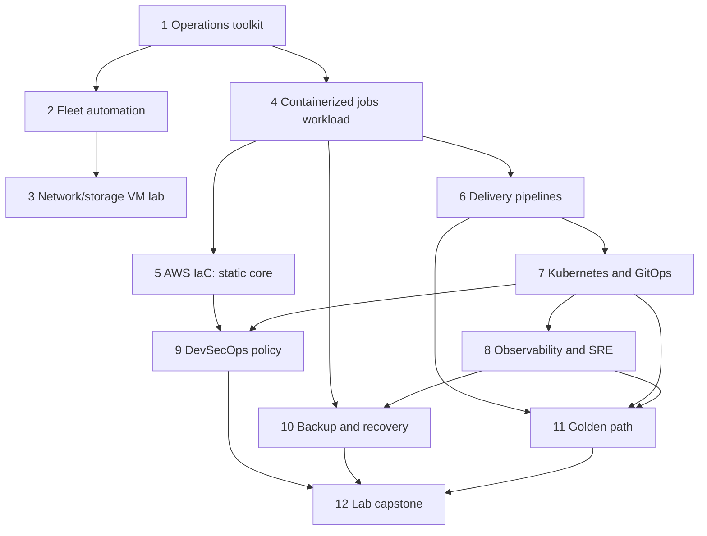

# Dependency map

Repository order follows operational dependencies and keeps one engineering
project active. Hub upkeep supports the active project and does not create another
implementation workstream. This diagram describes the plan; the first
four engineering cores have verified releases. Cloud foundation IaC is the only
active engineering project, beginning dependency review and a local OpenTofu/AWS
static/mock core. Cloud execution remains disabled.

The numerical sequence remains the default execution order even where a graph
edge allows independence. Future project activation requires a bounded core
acceptance checklist and a supported execution environment first.

| Consumer | Required producer / contract | Reproduction rule |
| --- | --- | --- |
| Fleet and network/storage labs | Operations toolkit checks, when used | Pin a tested toolkit release; never depend on an untracked sibling checkout. |
| Network/storage lab | Released fleet provider at `1531b86b54eee87d01da83f7b55d7d405f43fadb` | `component.lock.json` pins the provider source and license hashes; standalone bootstrap downloads and verifies it; each checkout owns separate provider state. No sibling import. |
| Container platform | Same released fleet-provider component, pinned images/engine/runtime packages | Standalone locks and hash checks; a separate owned VZ inventory and guest engine. Existing host Docker/Colima contexts are not adopted. The formal ARM64 VM/Compose lifecycle passed at `3d58b9f7107f`; v0.1.0 and exact-target CI are verified at `cdea68d2a446`. |
| Delivery | Reference app source, tests, build definition | Pin app revision/release; core checks reproduce locally. |
| Kubernetes | Reference app artifact/configuration and delivery contract | Pin immutable artifact digest once authorized to publish; otherwise document locally built image and source revision accurately. |
| Observability | Reference app instrumentation and deployed workload | Pin compatible instrumentation and platform releases, with minimal and extended profiles. |
| Security | Delivery/IaC/Kubernetes artifacts as applicable | Test each policy against a specific input contract and safe fixtures. |
| Recovery | Reference PostgreSQL schema and identifiable synthetic data | Pin schema/seed versions; restore into a distinct destination. |
| Golden path | Validated workload/platform/telemetry contracts | Generated services use explicit versioned dependencies, not original-account assumptions. |
| Capstone | Completed, tested producer releases | A manifest pins each producer; scripts fetch or verify releases without copying codebases. |

The reference workload is implemented locally as an asynchronous synthetic
text-analysis service: Python API and separate worker, PostgreSQL durable queue
and job state, Valkey completed-result cache, and nginx. PostgreSQL is the source
of truth; there is no separate cache-backed job queue. Formal local controller,
clone and ARM64 VM/Compose validation passed at `3d58b9f7107f`. Its verified
[v0.1.0 release](https://github.com/Yash-PK/ops-containerized-service-platform/releases/tag/v0.1.0) targets
`cdea68d2a446d2c3e9c62f56631f4cc8a01ed3fe`. Delivery, Kubernetes, observability,
security and recovery must pin this common application's tested revision. The hub
contains only its ledger, never a copy or implicit sibling import.

The container project pins Python 3.14.7, Psycopg 3.3.6, valkey-py 6.1.1,
PostgreSQL 18.6, Valkey 9.1.2 and nginx 1.30.5 after official dependency review.
Its owned ARM64 guest profile selects Docker 29.8.2, Compose 5.6.0 and Buildx
0.38.0. These are implemented input locks, not proof that every image architecture
or runtime profile has been exercised. Rootless Podman remains planned.

The completed network/storage project also pins Lima VZ, an official Ubuntu ARM64
image and 41 selected packages from snapshot `20261007T000000Z`. Its authenticated
reboot must run locked kernel `6.8.0-146-generic` before profiles. Namespace clients
and loop-backed disks are created only inside the owned VM. The formal all-profile VM run verified this dependency revision and cleanup. These pins do not establish KVM/libvirt or another provider.

No remote source, dependency version, image digest, or cross-project release has
been invented here. Each active project records official support/release/advisory
research before selecting dependencies. A project must have a standalone
quickstart with exact compatible versions and lockfiles where applicable.

Cloud credentials, an authenticated plan, cloud deployment, package publication,
and public service exposure are not implicit prerequisites for local cores. Any
future profile requiring them stays gated until explicitly authorized.
